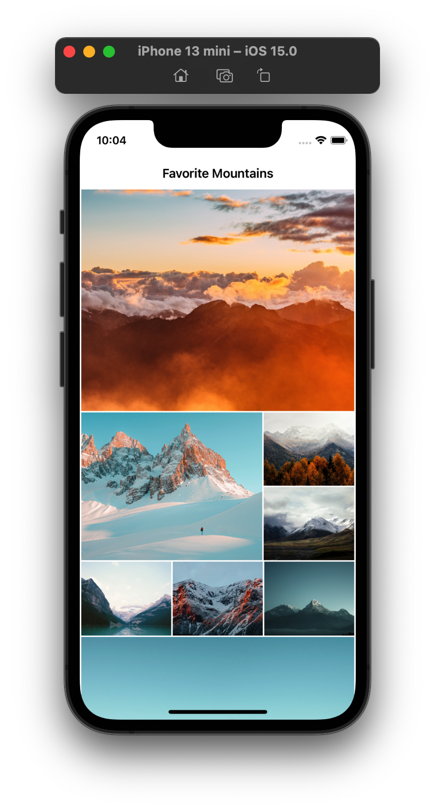

#  SwiftUI Gallery

This project was inspired by Apple's WWDC 2020 session "Stacks, Grids, and Outlines in SwiftUI".

In this project, we explore how to use LazyVGrid to create a performant gallery. 

## Credits(Images)
* Photo by  [Daniel Leone](https://unsplash.com/@danielleone?utm_source=unsplash&utm_medium=referral&utm_content=creditCopyText)  on  [Unsplash](https://unsplash.com/s/photos/mountains?utm_source=unsplash&utm_medium=referral&utm_content=creditCopyText) 
* Photo by  [Kaidi Guo](https://unsplash.com/@kaidi_guo?utm_source=unsplash&utm_medium=referral&utm_content=creditCopyText)  on  [Unsplash](https://unsplash.com/s/photos/mountains?utm_source=unsplash&utm_medium=referral&utm_content=creditCopyText) 
* Photo by  [Daniel Roe](https://unsplash.com/@danielroe?utm_source=unsplash&utm_medium=referral&utm_content=creditCopyText)  on  [Unsplash](https://unsplash.com/s/photos/mountains?utm_source=unsplash&utm_medium=referral&utm_content=creditCopyText) 
* Photo by  [Nathan Anderson](https://unsplash.com/@nathananderson?utm_source=unsplash&utm_medium=referral&utm_content=creditCopyText)  on  [Unsplash](https://unsplash.com/s/photos/mountains?utm_source=unsplash&utm_medium=referral&utm_content=creditCopyText) 
* Photo by  [eberhard 🖐 grossgasteiger](https://unsplash.com/@eberhardgross?utm_source=unsplash&utm_medium=referral&utm_content=creditCopyText)  on  [Unsplash](https://unsplash.com/s/photos/mountains?utm_source=unsplash&utm_medium=referral&utm_content=creditCopyText) 
* Photo by  [Cristina Gottardi](https://unsplash.com/@cristina_gottardi?utm_source=unsplash&utm_medium=referral&utm_content=creditCopyText)  on  [Unsplash](https://unsplash.com/s/photos/mountains?utm_source=unsplash&utm_medium=referral&utm_content=creditCopyText) 
* Photo by  [Nitish Meena](https://unsplash.com/@nitishm?utm_source=unsplash&utm_medium=referral&utm_content=creditCopyText)  on  [Unsplash](https://unsplash.com/s/photos/mountains?utm_source=unsplash&utm_medium=referral&utm_content=creditCopyText) 
* Photo by  [Nicolas Cool](https://unsplash.com/@shotz?utm_source=unsplash&utm_medium=referral&utm_content=creditCopyText)  on  [Unsplash](https://unsplash.com/s/photos/mountains?utm_source=unsplash&utm_medium=referral&utm_content=creditCopyText) 
* Photo by  [Cristina Gottardi](https://unsplash.com/@cristina_gottardi?utm_source=unsplash&utm_medium=referral&utm_content=creditCopyText)  on  [Unsplash](https://unsplash.com/s/photos/mountains?utm_source=unsplash&utm_medium=referral&utm_content=creditCopyText) 
